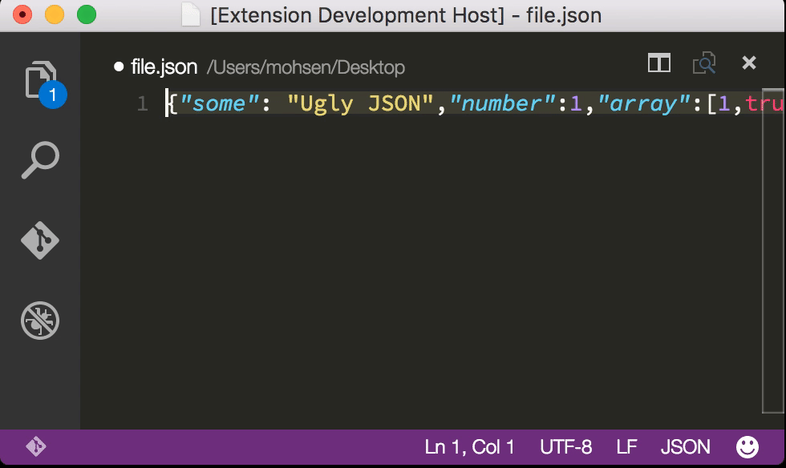

# Visual Studio Code Prettify JSON Extension

> Prettify ugly JSON inside VSCode

## Installation

Install via package manager. Hit `F1` or `"cmd+shift+p"` and type `install` and then type `Prettify JSON` and hit enter.

## License
MIT